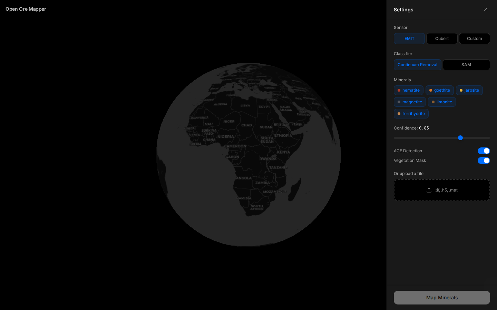

# Open Ore Mapper

**Work-in-progress.** Local-first tool for producing candidate surface mineral signature maps from hyperspectral raster cubes, using public spectral matching methods.

This tool identifies spectral *candidates* that warrant field validation. It does **not** detect buried ore bodies, confirm mineral presence, or replace petrology/geochemistry.

---

## Working Today

| Capability | Status |
|---|---|
| CLI (`predict`, `qc-raster`, `list-scenes`, `download-scene`, `fetch-library`) | Stable |
| FastAPI service (upload, predict, QC, tileserver) | Stable |
| SAM + NNLS classification pipeline | Default path |
| Raster quality control (band-level, pixel-level) | Stable |
| User-provided spectral library CSV | Stable |
| Public scene catalog (Cuprite, Salinas-A, Indian Pines) | Stable |
| Synthetic demo spectra (6 minerals) | Bundled for testing |
| React/TypeScript frontend (map tiles, upload UI) | In development |
| Docker Compose (backend only) | Development use |

## Experimental / Not Yet Wired

| Feature | Module exists? | Wired in pipeline? | Notes |
|---|---|---|---|
| SFF classifier (`classifier="sff"`) | `sff.py` + `continuum_removal.py` | Conditional | Pixel-level loop, slow on large cubes |
| Default `classifier="continuum_removal"` | `continuum_removal.py` | **Not gated** | Schema default is misleading — `_classify_core` ignores it; SAM+NNLS runs regardless |
| ACE sub-pixel detection (`use_ace=True`) | `ace.py` | No | Schema field defined; never invoked |
| MTMF (`use_mtmf=True`) | `mtmf.py` | No | Not invoked; `use_mtmf` defaults to `False` and is inert |
| SUnSAL sparse unmixing (`unmixing:`) | `sunsal.py` | No | `should_use_sunsal()` never checked |
| Vegetation masking (`vegetation_mask=True`) | `vegetation.py` | No | Schema field defined; never applied |
| Topographic correction | Planned | No | Schema fields defined (`topographic_correct`, `dem_type` etc.) |
| RELAB PDS fetcher (`relab_fetcher.py`) | Yes — index + download + resample | No — CLI `fetch-library` exists but PDS directory layout changed | Inventory discovery broken; PDS4-corpus workflow tracked in SPECTRAL_LIBRARIES_RESEARCH.md |

**Bottom line:** SAM + NNLS works end-to-end and is the only pipeline that affects final output. All other classifier/feature options at `MapperOptions` are partially implemented placeholders.

## Architecture

```
CLI / API → load_cube (.tif/.h5/.mat)
          → QC (band filter, valid pixels)
          → load/resample spectral library
          → normalize (l2 / percentile / none)
          → tile loop: SAM angles + NNLS abundances → fuse (0.6×SAM + 0.4×NNLS)
          → threshold → render PNG + JSON statistics
```

Backend: Python 3.10+, FastAPI, NumPy/SciPy, tifffile, h5py.
Frontend: React 19, TypeScript, Vite, Tailwind 4, MapLibre GL.

## Quickstart

### Backend

```bash
pip install -e '.[dev,api]'
open-ore-mapper predict examples/demo_scene.tif --sensor cubert_ultris_s5 --minerals hematite_demo --output-dir outputs/demo
```

API:

```bash
uvicorn open_ore_mapper.api:app --host 127.0.0.1 --port 8000
# Open http://127.0.0.1:8000/
```

### Frontend

```bash
cd frontend && npm install && npm run dev
# Open http://localhost:5173/ (proxies API to :8000 per vite.config.ts)
```

### Docker (backend only)

```bash
make dev   # docker compose up --build -d  (starts backend on port 8000)
make build # docker compose build
```

### Tests

```bash
make test              # pytest -v
make lint              # ruff check (separate: make typecheck for mypy)
cd frontend && npm run test:e2e   # Playwright E2E (UI-state only; no backend end-to-end processing)
```

## Supported File Types

| Format | Details |
|---|---|
| `.tif` / `.tiff` | GeoTIFF, any band layout (auto-detected HWC) |
| `.h5` / `.hdf5` / `.nc` | HDF5/NetCDF; reads embedded `/wavelengths` and `sensor_band_parameters/good_wavelengths` |
| `.mat` | MATLAB v5+; picks first 3D floating array or known keys (`cube`, `data`, `hsi`, `SalinasA_corrected`, etc.) |

## EMIT Bounding-Box Pipeline (Experimental)

`POST /v1/predict/bbox` accepts a WGS84 bbox, searches NASA Earthdata for EMIT L2A Reflectance granules, downloads + orthorectifies + classifies the best candidate.

**Known limitations:**

| Limitation | Detail |
|---|---|
| In-process execution | Background task in the uvicorn process via FastAPI/Starlette BackgroundTasks; no separate worker queue. Synchronous callables are offloaded to a thread pool so they do not directly block the event loop, but remain tied to the API process lifetime and consume process/thread/memory resources. |
| First-tile QC only | QC analyzes the first orthorectified tile, not the full scene. |
| Full-area processing | Orthorectification processes all tiles individually; memory use scales with scene size. |
| Georeferencing | `processed_bounds` reports pixel extent, not WGS84. Exact georeferencing from GLT metadata is not yet exposed. |
| Authentication | Requires Earthdata credentials via `EARTHDATA_USERNAME`/`EARTHDATA_PASSWORD` env vars. |
| Dependencies | Requires `[emit]` extras: `pip install -e '.[emit]'` (xarray, netcdf4, earthaccess). The Docker image includes `[api,emit]` so the bbox endpoint is available. |

## Spectral Library Reality

**Bundled demo library** (`examples/demo_library.csv`): synthetic analytic curves for software testing only. **Not safe for scientific use.**

**RELAB PDS fetcher** (`open-ore-mapper fetch-library`): experimental inventory-discovery script. The PDS directory layout changed post-publication and the hardcoded URL traversal is likely broken. Not wired into any pipeline path. Cached locally at `~/.cache/open-ore-mapper/relab/`.

**Authoritative corpus underway:** SPECTRAL_LIBRARIES_RESEARCH.md documents a verified PDS4-spectra bundling workflow. No authoritative library is yet bundled in-tree.

Always provide a user spectral library via `--library` when doing real work.

### Spectral Library CSV Format

```csv
name,wavelength,reflectance
hematite_demo,450,0.42
hematite_demo,550,0.30
goethite_demo,450,0.38
goethite_demo,550,0.44
```

Required columns: `name`, `wavelength`, `reflectance`. Wavelengths must be strictly increasing per mineral. Selected minerals must share the same wavelength grid. All reflectance values must be finite.

## CLI Commands

| Command | Purpose |
|---|---|
| `open-ore-mapper predict <input>` | Run SAM+NNLS classification |
| `open-ore-mapper qc-raster <input>` | Raster quality control report |
| `open-ore-mapper list-scenes` | List downloadable public HSI scenes |
| `open-ore-mapper download-scene <id>` | Download a public scene (.mat) |
| `open-ore-mapper fetch-library` | Fetch RELAB spectral library index/spectra |

## API Endpoints

| Method | Path | Purpose |
|---|---|---|
| GET | `/health` | Liveness check |
| GET | `/v1/minerals` | List available demo minerals |
| POST | `/v1/predict` | Upload file → classification |
| POST | `/v1/qc/raster` | Upload file → QC report |
| POST | `/v1/predict/bbox` | Bbox → EMIT search → classify |
| GET | `/v1/maps/{uuid}` | Fetch completed map result |
| GET | `/v1/maps/{uuid}/tiles/{z}/{x}/{y}.png` | Slippy map tiles |
| GET | `/v1/jobs/{job_id}` | Bbox job status |

## Screenshots



*Development UI showing the MapLibre GL globe with the Settings panel open. The globe displays a dark CartoDB basemap centered on the Atlantic. The Settings panel exposes sensor selection (EMIT, Cubert, Custom), classifier choice (Continuum Removal, SAM), mineral toggles, confidence threshold slider, ACE/vegetation-mask switches, file upload, and the Map Minerals action button.*

## Roadmap

See [ROADMAP.md](ROADMAP.md).

## License & Citation

Apache 2.0. See [LICENSE](LICENSE) and [PROVENANCE.md](PROVENANCE.md).

Spectral libraries cited in [SPECTRAL_LIBRARIES_RESEARCH.md](SPECTRAL_LIBRARIES_RESEARCH.md). Public hyperspectral scenes provided by the Grupo de Inteligencia Computacional, Universidad del País Vasco (EHU).

---

**This is a work-in-progress open-source project. All outputs are spectral candidates requiring field validation.**
