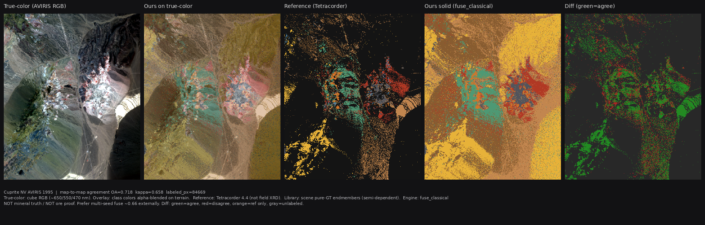
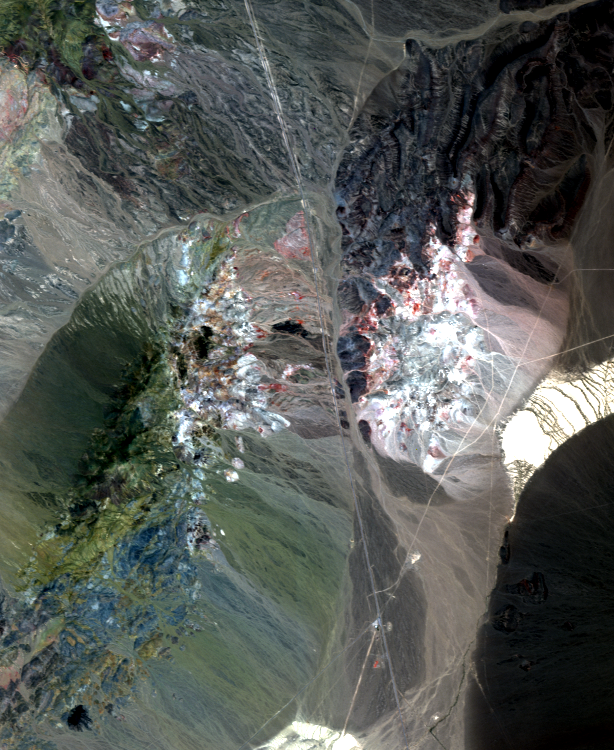
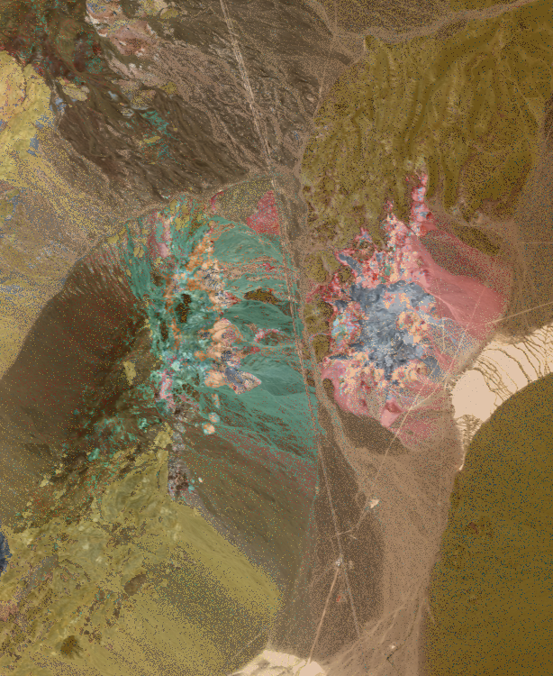
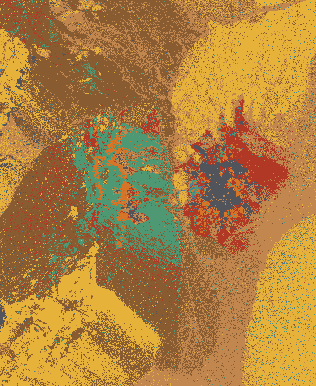
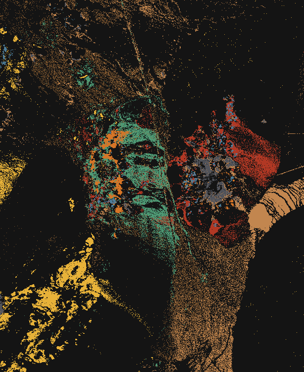
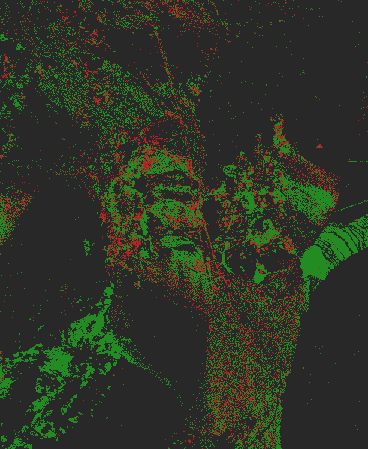
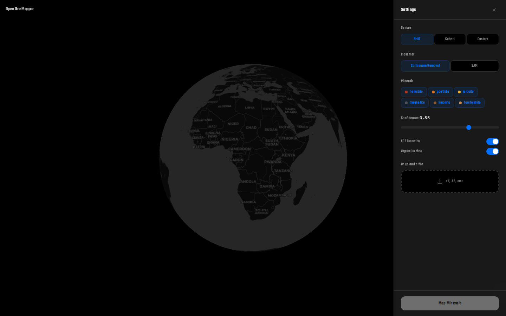

# Open Ore Mapper

**Local-first candidate surface mineral maps** from hyperspectral cubes — classical spectral matching first, honest scorecards, no “ore proof.”

This tool produces **spectral candidates** that warrant field validation. It does **not** detect buried ore, confirm mineral presence, or replace petrology / geochemistry.

---

## Cuprite result (product path)

**Method:** unsupervised classical `fuse_classical` (MTMF + continuum-removal SAM + MNF-SAM).  
**Reference:** Tetracorder 4.4 mineral maps (algorithmic labels, not field XRD).  
**Library:** scene endmembers from pure Tetracorder pixels (**semi-dependent** — map-to-map agreement, not independent discovery).

| Metric | Full-scene (diagnostic) | Spatial multi-seed (prefer externally) |
|--------|-------------------------|----------------------------------------|
| Agreement OA | **~0.72** | **~0.66 ± 0.09** |
| Kappa | ~0.66 | ~0.57 |

**Not product accuracy:** supervised RF / HistGB multi-seed (~0.79–0.82) are research **Track C** (Tetracorder imitation when labels exist). See [`docs/BEST_NUMBERS.md`](docs/BEST_NUMBERS.md).

### True-color + class mask (and full panel)



*AVIRIS true-color underlay · class mask on terrain · Tetracorder reference · solid class map · agreement diff. OA ≈ 0.72 full-scene is **map-to-map agreement**, not mineral truth.*

| True-color (cube RGB) | Class on true-color |
|-----------------------|---------------------|
|  |  |

| Ours (solid) | Reference | Diff |
|--------------|-----------|------|
|  |  |  |

Reproduce:

```bash
.venv/bin/python scripts/run_cuprite_real_validation.py
# → outputs/cuprite-real-eval/comparison_panel.png
# → outputs/cuprite-real-eval/metrics.json  (metric_framing: map_to_map_agreement)
```

---

## Working today

| Capability | Status |
|---|---|
| **Cuprite real validation** (`fuse_classical` default) | **Shipped** — panel + metrics + honest framing |
| Classical stack: SAM, CR-SAM, MTMF, MNF-SAM, **fuse_classical** | Wired in `OreMapper` / validation script |
| CLI `predict`, `qc-raster`, public scenes | Stable |
| FastAPI upload / predict / QC / tiles | Stable |
| Fail-closed spectral library matching | Stable |
| Spatial multi-seed research eval | Shipped (`scripts/spatial_split_eval.py`) |
| React frontend (globe + scorecard) | Usable; scorecard = **map-to-map agreement** |
| Supervised RF / boosting / 1D-CNN research | Optional (`.[ml]`); **not** product default |
| EMIT bbox pipeline | Experimental (Earthdata creds + `[emit]`) |

### Still incomplete / experimental

| Item | Notes |
|---|---|
| Schema/API default classifier still often `sam` | Cuprite **script** defaults to `fuse_classical` |
| ACE, vegetation mask, SUnSAL toggles | Not fully wired in all UI paths |
| Authoritative bundled USGS library | Prefer user CSV / scene endmembers for now |
| Independent library Track A multi-seed | Deferred integrity track |
| Full EMIT Path B product polish | After classical Path A is boringly solid |

---

## Product rule (incremental base)

```text
Unlabeled scene  →  classical library / hourglass matching  →  map + confidence
Labeled ROIs     →  optional supervised research (never the default demo hero)
```

We build **incrementally on the classical unlabeled path**. Supervised OA is research-only.

Docs:

| Doc | Use |
|-----|-----|
| [`README.md`](README.md) | Living product plan |
| [`docs/BEST_NUMBERS.md`](docs/BEST_NUMBERS.md) | Scoreboard Tracks A/B/C |
| [`docs/research_scrapes/ADVERSARIAL_CONSENSUS.md`](docs/research_scrapes/ADVERSARIAL_CONSENSUS.md) | Binding claim language |
| [`docs/research_scrapes/SUPERVISOR_GO_NOGO.md`](docs/research_scrapes/SUPERVISOR_GO_NOGO.md) | GO decision |
| [`ROADMAP.md`](ROADMAP.md) | Development roadmap |

---

## Architecture (product path)

```text
Cube + wavelengths + library CSV
  → QC / band filter
  → classical match (fuse_classical default on Cuprite validation)
  → class map + confidence
  → optional: evaluate vs reference → agreement OA / κ / panel
```

Backend: Python 3.10+, FastAPI, NumPy/SciPy, tifffile.  
Frontend: React 19, TypeScript, Vite, Tailwind, MapLibre GL.

---

## Quickstart

### 1) Quickstart (Cuprite benchmark) — Cuprite (recommended)

Requires `benchmarks/cuprite_real/` (scene + Tetracorder reference).

```bash
python -m venv .venv && source .venv/bin/activate   # or use existing .venv
pip install -e '.[dev,api]'   # optional: '.[ml]' for research baselines only

.venv/bin/python scripts/run_cuprite_real_validation.py
```

| Artifact | Path |
|----------|------|
| Panel | `outputs/cuprite-real-eval/comparison_panel.png` |
| Metrics | `outputs/cuprite-real-eval/metrics.json` |
| Report | `outputs/cuprite-real-eval/report.md` |

### 2) CLI on any cube

```bash
open-ore-mapper predict path/to/cube.tif \
  --sensor manual \
  --library path/to/library.csv \
  --minerals hematite,goethite,kaolinite \
  --output-dir outputs/run
```

### 3) API + UI

```bash
uvicorn open_ore_mapper.api:app --host 127.0.0.1 --port 8000
# http://127.0.0.1:8000/

cd frontend && npm install && npm run dev
# http://localhost:5173/
```

### 4) Docker (backend)

```bash
make dev    # docker compose up --build -d
make test   # pytest
```

---

## Development UI



*MapLibre shell + settings. Scorecard wording is **map-to-map agreement** (not field truth). Some advanced toggles remain experimental.*

---

## How to read numbers

| Number | Meaning |
|--------|---------|
| **~0.72 full-scene fuse** | Track B diagnostic — agreement with Tetracorder using pure-GT endmembers |
| **~0.66 multi-seed fuse** | Preferred **external classical** bar (spatial hold-out) |
| **~0.79–0.82 supervised** | Track C research only — needs train labels; not the product default |

Always: **candidates only · agreement ≠ ore proof.**

---

## Spectral libraries

| Source | Role |
|--------|------|
| User CSV (`name,wavelength,reflectance`) | Production path |
| Cuprite scene endmembers (validation) | Semi-dependent benchmark |
| `examples/demo_library.csv` | Software tests only — **not science** |
| USGS / RELAB / ECOSTRESS | Research / fetch workflows — see `SPECTRAL_LIBRARIES_RESEARCH.md` |

---

## CLI & API (summary)

| CLI | Purpose |
|-----|---------|
| `open-ore-mapper predict` | Classify a cube |
| `open-ore-mapper qc-raster` | QC report |
| `open-ore-mapper list-scenes` / `download-scene` | Public HSI catalog |
| `open-ore-mapper fetch-library` | RELAB helper (experimental) |

| API | Purpose |
|-----|---------|
| `POST /v1/predict` | Upload → map |
| `POST /v1/qc/raster` | QC |
| `POST /v1/predict/bbox` | EMIT bbox (experimental) |
| `GET /v1/maps/{uuid}` | Result + optional scorecard |

---

## Tests

```bash
make test
.venv/bin/python -m pytest tests/test_evaluate.py tests/test_cuprite_demo_path.py -q
```

---

## License

Apache 2.0 — [LICENSE](LICENSE), [PROVENANCE.md](PROVENANCE.md).

Public scenes / libraries retain their upstream licenses and citation requirements.

---

**Work in progress. All outputs are spectral candidates requiring field validation.**
